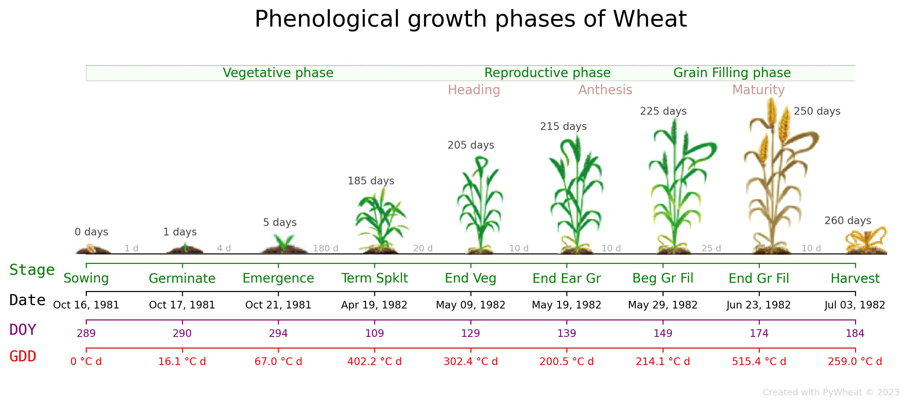

<!-- ---
hide:
  - navigation
  #- toc
--- -->
<!-- <p align="center">
  <a href="https://pypi.org/project/pywheat"></a>
  <a href="https://opensource.org/licenses/"></a>
  
</p> -->

# Getting started

The following instructions allow you to determine the phenological phases of wheat. 

---

## Creating application directory and installing dependencies

Launch your terminal and navigate to your desired location to create the project directory. Run the following commands to create a directory for your project:

``` sh
mkdir <`subfolder`>
cd <`subfolder`>
```

Create a virtual environment with:

``` sh
python3 -m venv venv
```
!!! Note
    Please follow the [installation instructions] to complete the steps above according to your local system.


## Setup a folder

Enter a folder or subfolder of your project root where you created the python environment and activate it.
``` sh
# cd <`subfolder`>
source ./venv/bin/activate
```
If you didn't install the `venv` yet, please review the detailed [installation instructions]

  [installation instructions]: installation.md

## Install library

Setting up PyWheat is as simple as using the familiar `pip install` command. By executing the following line, you will have the library installed and ready to use:

``` sh
pip install pywheat
```

### Verify install
``` sh
python3 -c "import pywheat; print(pywheat.__version__)"
```

If a version similar to `pywheat version 0.0.5` is returned, you've installed the package successfully.
!!! Success  "Success: PyWheat package is now installed."

---

???+ example "View Sample quickstart for beginners"

    To get started with PyWheat, we need to create a project folder and install a python virtual environment for our packages and further analysis as follows:
    
    === "Shell"

      ```sh
      mkdir pywheat_Project_2023;cd pywheat_Project_2023;
      python3 -m venv venv
      source . venv/bin/activate
      pip install pywheat
      python3 -c "import pywheat; print(pywheat.__version__)"
      ```

???+ info "Quick Start"
    ### An easy way to learn and use PyWheat package

    No install necessary, run the PyWheat [tutorials] directly in the browser with [Colaboratory], a Google research project created to help disseminate machine learning education and research. It's a [Jupyter notebook] environment that requires no setup to use and runs entirely in the cloud.

      [tutorials]: https://colab.research.google.com/drive/1EqdnmH1a8Vamze-evpMZBlz6jmvDQXDI?usp=sharing
      [Colaboratory]: https://colab.research.google.com/notebooks/welcome.ipynb
      [Jupyter notebook]: https://jupyter.org/

    [](https://colab.research.google.com/drive/1EqdnmH1a8Vamze-evpMZBlz6jmvDQXDI?usp=sharing)
---

Note: this tutorial is also available as a single python notebook. You can download it on Github below:

[Download Python Notebook](https://github.com/egiron/pywheat/blob/main/docs/notebooks/Getting_Started.ipynb){ .md-button .md-button--primary}

Once pywheat library is successfully installed, you can import the essential modules for dataset creation and data pre-processing.

## Load a dataset <small>recommended for beginners</small> { #Load-a-dataset data-toc-label="Load a dataset" }

Load and prepare the trial dataset. 

### Loading the data { #loading-the-data data-toc-label="loading the data"}

Example dataset can be loaded directly from the library, as follows:

``` py hl_lines="2 4"
import pywheat
from pywheat.data import load_dataset # Function to load existing dataset
# Load example dataset (Weather data for an example site)
data = load_dataset()
# Display Weather
data['Weather'].head()
```

## Determine Phenological stage

The `pheno` module contains all of the required functions to analyse the data and display the wheat phenology

``` python
# Load module
from pywheat.pheno import determine_phenology_stage
```
### Model configuration

``` python
# ------------------------
# MODEL CONFIGURATION
# ------------------------
# Define the Path where the output data will be stored
PATH_PRJ = '/Users/ernestogiron/Desktop/WheatPhenology/'
RESULTS_PATH = PATH_PRJ + 'results/'

# Initialization of variables 
params = dict(
        sowing_date = "1981-10-16", # Sowing date in YYYY-MM-DD
        latitude = 39.0, # Latitude of the site
        GDDE = 6.2, # Growing degree days per cm seed depth required for emergence, GDD/cm
        VREQ  = 505.0, # Vernalization required for max.development rate (VDays)
        PHINT = 95.0, # Phyllochron. A good estimate for PHINT is 95 degree days. This value for PHINT is appropriate except for spring sown wheat in latitudes greater than 30 degrees north and 30 degrees south, in which cases a value for PHINT of 75 degree days is suggested. 
        P1V = 4.85, # development genetic coefficients, vernalization. 1 for spring type, 5 for winter type
        P1D = 3.675, # development genetic coefficients, Photoperiod (1 - 6, low - high sensitive to day length)
)
```

### Run model to estimate the phenology

``` python
growstages = determine_phenology_stage(initparams=params, weather=data['Weather'], dispDates=True, dispFigPhenology=False, verbose=False)

```

``` raw
RSTG   GROWTH STAGE      DAP  DOY   CROP AGE   SUMDTT   DATE 
7      Sowing              0  289      0            0   1981-10-16
8      Germinate           1  290      1         16.1   1981-10-17
9      Emergence           5  294      4         67.0   1981-10-21
1      Term Spklt        185  109    180        402.2   1982-04-19
2      End Veg           205  129     20        302.4   1982-05-09
3      End Ear Gr        215  139     10        200.5   1982-05-19
4      Beg Gr Fil        225  149     10        214.1   1982-05-29
5      End Gr Fil        250  174     25        515.4   1982-06-23
6      Harvest           260  184     10        259.0   1982-07-03
```

### Draw the phenological phases

``` python
# Using the option dispFigPhenology=True in step above or 

# Load Utils module to customize
from pywheat.utils import drawPhenology

# Display a figure with the phenological stages determined in the step above
drawPhenology(gs=growstages, title='Phenological growth phases of Wheat', dpi=300,
             dispPlants=True, topDAPLabel=True, timeSpanLabel=True, topNameStageLabel=True,
             topNameStageLabelOpt=True, copyrightLabel=True, 
             saveFig=True, showFig=True, path_to_save_results='./', 
             fname='Fig_1_Phenological_Phases_Wheat', fmt='jpg')

```


## Conclusion


!!! success "Congratulations"

    You have run a simulation using a prebuilt dataset and the [PyWheat API](reference/index.md).


<!-- [Next: Running models](combinations.md){ .md-button} -->


